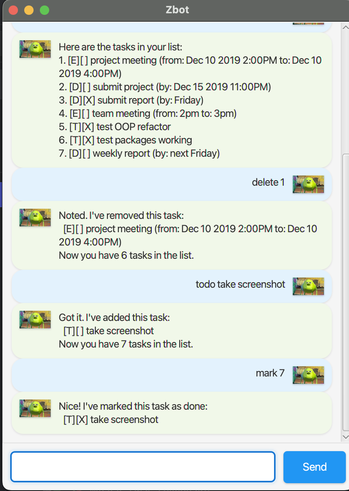

# Zbot User Guide



Zbot is a **desktop app for managing tasks, optimized for use via a Command Line Interface** (CLI) while still having the benefits of a Graphical User Interface (GUI). If you can type fast, Zbot can get your task management done faster than traditional GUI apps.

## Quick Start

1. Ensure you have Java `17` or above installed in your Computer.

2. Download the latest `zbot.jar` from [here](../../releases).

3. Copy the file to the folder you want to use as the _home folder_ for your Zbot.

4. Open a command terminal, `cd` into the folder you put the jar file in, and use the `java -jar zbot.jar` command to run the application.
   A GUI similar to the below should appear in a few seconds. Note how the app contains some sample data.<br>
   

5. Type the command in the command box and press Enter to execute it. Some example commands you can try:

   * `list` : Lists all tasks.

   * `todo read book` : Adds a todo task named "read book" to the task list.

   * `delete 3` : Deletes the 3rd task shown in the current list.

   * `bye` : Exits the app.

6. Refer to the [Features](#features) below for details of each command.

--------------------------------------------------------------------------------------------------------------------

## Features

<box type="info" seamless>

**Notes about the command format:**<br>

* Words in `UPPER_CASE` are the parameters to be supplied by the user.<br>
  e.g. in `todo DESCRIPTION`, `DESCRIPTION` is a parameter which can be used as `todo read book`.

* Parameters must be in the exact order shown.<br>
  e.g. if the command specifies `deadline DESCRIPTION /by DATE`, both `DESCRIPTION` and `DATE` must be provided in that order.

</box>

### Viewing all tasks: `list`

Shows a list of all tasks in the task list.

**Format:** `list`

**Example:**
```
list
```

**Expected output:**
```
Here are the tasks in your list:
1.[T][ ] read book
2.[D][ ] submit report (by: Oct 15 2023)
3.[E][ ] team meeting (from: 2pm to: 4pm)
```

### Adding a todo task: `todo`

Adds a todo task to the task list.

**Format:** `todo DESCRIPTION`

**Examples:**
* `todo read book`
* `todo buy groceries`

**Expected output:**
```
Got it. I've added this task:
  [T][ ] read book
Now you have 1 task in the list.
```

### Adding a deadline task: `deadline`

Adds a deadline task to the task list.

**Format:** `deadline DESCRIPTION /by DATE`

**Examples:**
* `deadline submit report /by Oct 15 2023`
* `deadline assignment 1 /by 2023-10-15`

**Expected output:**
```
Got it. I've added this task:
  [D][ ] submit report (by: Oct 15 2023)
Now you have 2 tasks in the list.
```

### Adding an event task: `event`

Adds an event task to the task list.

**Format:** `event DESCRIPTION /from START_TIME /to END_TIME`

**Examples:**
* `event team meeting /from 2pm /to 4pm`
* `event conference /from 2023-10-15 9am /to 2023-10-15 5pm`

**Expected output:**
```
Got it. I've added this task:
  [E][ ] team meeting (from: 2pm to: 4pm)
Now you have 3 tasks in the list.
```

### Marking a task as done: `mark`

Marks the specified task as completed.

**Format:** `mark INDEX`

* Marks the task at the specified `INDEX` as done.
* The index refers to the index number shown in the displayed task list.
* The index **must be a positive integer** 1, 2, 3, …​

**Examples:**
* `list` followed by `mark 2` marks the 2nd task in the task list as done.

**Expected output:**
```
Nice! I've marked this task as done:
  [T][X] read book
```

### Unmarking a task: `unmark`

Marks the specified task as not completed.

**Format:** `unmark INDEX`

* Marks the task at the specified `INDEX` as not done.
* The index refers to the index number shown in the displayed task list.
* The index **must be a positive integer** 1, 2, 3, …​

**Examples:**
* `list` followed by `unmark 2` marks the 2nd task in the task list as not done.

**Expected output:**
```
OK, I've marked this task as not done yet:
  [T][ ] read book
```

### Deleting a task: `delete`

Deletes the specified task from the task list.

**Format:** `delete INDEX`

* Deletes the task at the specified `INDEX`.
* The index refers to the index number shown in the displayed task list.
* The index **must be a positive integer** 1, 2, 3, …​

**Examples:**
* `list` followed by `delete 2` deletes the 2nd task in the task list.

**Expected output:**
```
Noted. I've removed this task:
  [T][ ] read book
Now you have 2 tasks in the list.
```

### Finding tasks: `find`

Finds tasks whose descriptions contain the given keyword.

**Format:** `find KEYWORD`

* The search is case-insensitive. e.g `book` will match `Book`
* Tasks matching the keyword will be displayed.

**Examples:**
* `find book` returns `read book` and `book review`
* `find meeting` returns `team meeting`

**Expected output:**
```
Here are the matching tasks in your list:
1.[T][ ] read book
2.[T][ ] book review
```

### Sorting tasks: `sort`

Sorts all tasks in the task list alphabetically by description.

**Format:** `sort`

**Example:**
```
sort
```

**Expected output:**
```
Tasks have been sorted alphabetically by description!
```

### Exiting the program: `bye`

Exits the program.

**Format:** `bye`

**Expected output:**
```
Bye. Hope to see you again soon!
```

### Saving the data

Zbot data are saved in the hard disk automatically after any command that changes the data. There is no need to save manually.

### Editing the data file

Zbot data are saved automatically as a text file `[JAR file location]/data/zbot.txt`. Advanced users are welcome to update data directly by editing that data file.

<box type="warning" seamless>

**Caution:**
If your changes to the data file makes its format invalid, Zbot will discard all data and start with an empty data file at the next run. Hence, it is recommended to take a backup of the file before editing it.

</box>

--------------------------------------------------------------------------------------------------------------------

## FAQ

**Q**: How do I transfer my data to another Computer?<br>
**A**: Install the app in the other computer and overwrite the empty data file it creates with the file that contains the data of your previous Zbot home folder.

**Q**: What date formats are supported?<br>
**A**: Zbot accepts various natural date formats including `Oct 15 2023`, `2023-10-15`, and relative dates like `tomorrow`.

**Q**: Can I undo a command?<br>
**A**: Currently, Zbot does not support undo functionality. Please double-check your commands before executing them.

--------------------------------------------------------------------------------------------------------------------

## Command Summary

| Action     | Format, Examples                                                                                        |
|------------|---------------------------------------------------------------------------------------------------------|
| **List**   | `list`                                                                                                  |
| **Todo**   | `todo DESCRIPTION` <br> e.g., `todo read book`                                                         |
| **Deadline** | `deadline DESCRIPTION /by DATE` <br> e.g., `deadline submit report /by Oct 15 2023`                 |
| **Event**  | `event DESCRIPTION /from START_TIME /to END_TIME` <br> e.g., `event meeting /from 2pm /to 4pm`       |
| **Mark**   | `mark INDEX` <br> e.g., `mark 3`                                                                       |
| **Unmark** | `unmark INDEX` <br> e.g., `unmark 3`                                                                   |
| **Delete** | `delete INDEX` <br> e.g., `delete 3`                                                                   |
| **Find**   | `find KEYWORD` <br> e.g., `find book`                                                                  |
| **Sort**   | `sort`                                                                                                  |
| **Exit**   | `bye`                                                                                                   |